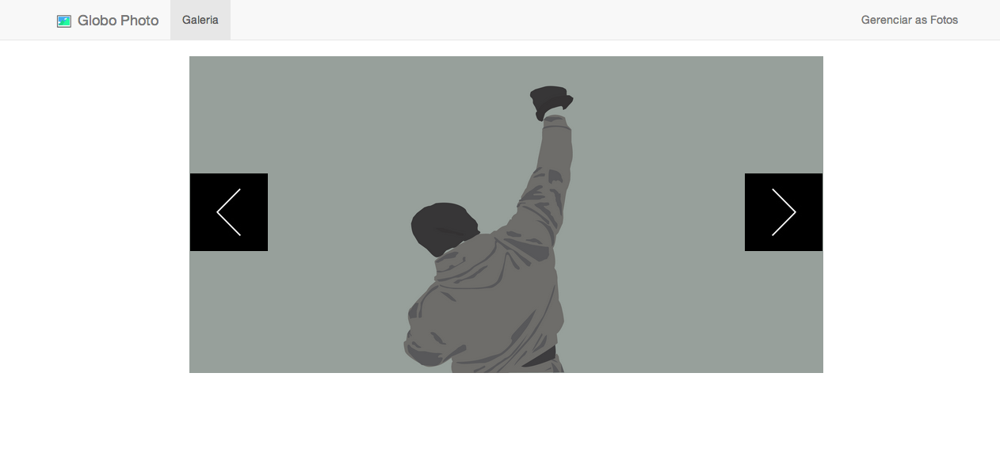

.. Globo Photo documentation master file, created by
   sphinx-quickstart on Sun Jun  8 01:27:39 2014.
   You can adapt this file completely to your liking, but it should at least
   contain the root `toctree` directive.

Bem vindo à documentação do Globo Photo
========================================

Globo Photo é um projeto desenvolvido para exibir as fotos que
você for colocar no sistema. É exigido de forma elegando, através de
um slider, que facilita na navegação.

**Funcionalidades:**

- Design responsivo;
- Gerenciamento de fotos, com visualização de cada imagem;
- Feito com menos plugins possível, melhorando assim a performance;
- Por ser feito de forma simples, a dificuldade de evoluir é pequena.

Documentação:
---------------

.. toctree::
    :maxdepth: 2

    architecture
    installation
    photo_manager
    api

Índices e tabelas
==================

* :ref:`genindex`
* :ref:`modindex`
* :ref:`search`

