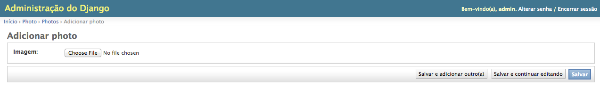
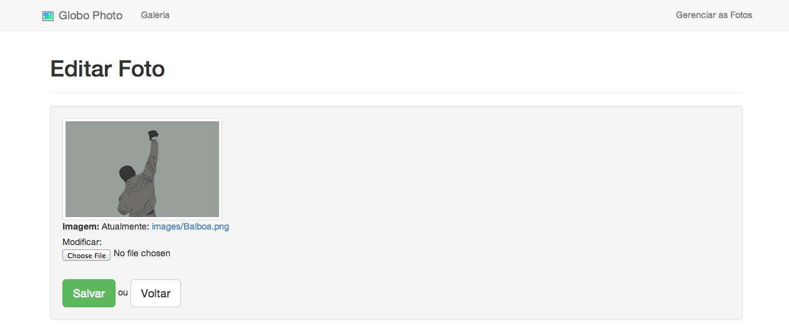

Gerenciador de Fotos
======================

A Globo photo tem duas formas de gerenciar suas fotos: pelo django admin ou pelo gerenciador desenvolvido no projeto.

1. Pelo Django Admin
----------------------

O Django disponibiliza uma ferramentas de administração chamado django-admin, que é preparado para esse tipo de necessidade.

Durante a configuração do projeto, ele pediu para criar um super-usuário, que é o administrador que irá acessar esse painel. Quando acessar **http://localhost:8000/admin**, vai mostrar essa página:

Você preenche o usuário e a senha que criou e clica em `Acessar`. Como você pode ver logo abaixo, o painel administrativo é simples e direto:

Além do gerenciador das fotos, você tem como manter usuários e papéis no sistema, caso queria. Ao entrar na seção de fotos do painel, você visualiza a lista de fotos cadastradas:

Já na propria lista de fotos, você tem a opção de editar, selecionando um dos itens da lista, como também remover. Para remover, marque a foto que deseja e selecione em `Ação` a opção `Remover photos selecionados`:

Em caso de editar, clique no nome da foto. Para criar uma foto, você vai na opção `Adicionar photo`. Clicando nesse botão, você será redirecionado para esse formulário:

Quando você anexa uma foto, você tem três opções:

- **Salvar e adicionar outro(a)**: O painel vai adicionar a foto anexada, e volta para o formulário para inserir outra foto.
- **Salvar e continuar editando**: Ele salva a foto, mas volta para o formulário caso mudou de idéia, e deseja editar.
- **Salvar**: Será salvo a foto e então depois vai para a lista de fotos cadastradas.

Caso tente salvar, sem anexar uma foto, um erro será exibido:

2. Pelo Gerenciador do Globo Photo
------------------------------------

Caso não queira ter o trabalho de logar e caso não tenha gostado do painel do Django, você tem a opção de usar o gerenciador da Globo Photo. Para acessar, clique na opção `Gereciar as Fotos` na página da galeria.

Ao clicar, será direcionado para essa página, que irá mostrar as fotos cadastradas:

Na lista de fotos você tem:

- **Opções**: Funções de editar ou excluir a foto selecionada.
- **Imagem**: Uma pré-visualização da foto.
- **Nome da Imagem**: É o nome da imagem anexada.
- **Download da Imagem**: Um link para você baixar a imagem selecionada.

Quando adiciona uma nova foto, clique no botão `Adicionar Foto`. O seu formulário será esse:

Anexando e salvando, será redirecionado para a lista novamente. Mas e se eu quiser editar? Simples, na lista de fotos clique na opção `Editar` da foto que deseja e terá isso:

Assim, você anexa outra foto e clica no `Salvar`. Feito isso, vai na lista de fotos novamente e irá na pré-visualização que a foto foi realmente substituida.

E finalmente, para excluir você clica na opção `Excluir`, e irá aparecer uma mensagem perguntando se realmente deseja fazer essa ação. Caso tenha certeza, clique em `Sim` e então a foto será removida.

